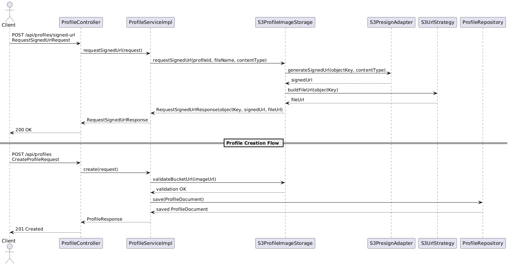
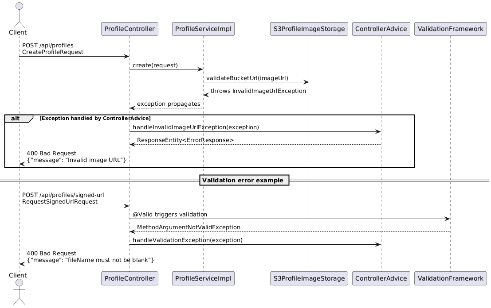

# be-challenge

Base repository for a Java backend challenge using **Spring Boot + Gradle**.

## Stack

- Java 25 (toolchain)
- Spring Boot 4.0.3
- Gradle Wrapper
- Spring Web MVC + Validation
- Spring Data MongoDB
- Lombok

## Run

```bash
./gradlew bootRun
```

App starts at `http://localhost:8080`.

## Challenge Skeleton

This repository intentionally provides only API contracts and structure. Business logic in service/storage and endpoint assertions in tests are intentionally left for the candidate.

## API Contract

### 1) Request S3 signed URL

`POST /api/profiles/signed-url`

- Content-Type: `application/json`
- Request body:
  - `fileName` (required)
  - `contentType` (required)

Example:

```bash
curl -X POST http://localhost:8080/api/profiles/signed-url \
  -H "Content-Type: application/json" \
  -d '{
    "fileName": "avatar.jpg",
    "contentType": "image/jpeg"
  }'
```

Expected response shape:

```json
{
  "objectKey": "profiles/<id>/avatar.jpg",
  "signedUrl": "https://<bucket>.s3.<region>.amazonaws.com/profiles/<id>/avatar.jpg?...",
  "fileUrl": "https://<bucket>.s3.<region>.amazonaws.com/profiles/<id>/avatar.jpg"
}
```

Upload flow:

1. Call `/api/profiles/signed-url`.
2. Use `signedUrl` to `PUT` the file to S3.
3. Send `fileUrl` to the profile creation endpoint below.

### 2) Create profile

`POST /api/profiles`

- Content-Type: `application/json`
- Body:
  - `name` (required)
  - `bio` (optional, max 500)
  - `imageUrl` (required, must point to configured bucket)

Example:

```bash
curl -X POST http://localhost:8080/api/profiles \
  -H "Content-Type: application/json" \
  -d '{
    "name": "Jane Doe",
    "bio": "Platform engineer",
    "imageUrl": "https://replace-me.s3.us-east-1.amazonaws.com/profiles/123/avatar.jpg"
  }'
```

Expected response shape:

```json
{
  "id": "9be4ea08-395d-4be1-9f13-c9167724b9dc",
  "name": "Jane Doe",
  "bio": "Platform engineer",
  "imageUrl": "https://replace-me.s3.us-east-1.amazonaws.com/profiles/.../profile.jpg"
}
```

## Candidate Goal

Implement the signed URL and profile creation flow so:

- clients upload directly to S3,
- profile creation only accepts a URL for the configured bucket,
- profile metadata is persisted in MongoDB.

Keep endpoint contracts as-is (`application/json`) and implement the internal behavior.

## Where to implement

- API entrypoint: `src/main/java/com/challenge/bechallenge/profile/api/ProfileController.java`
- Request model: `src/main/java/com/challenge/bechallenge/profile/api/CreateProfileRequest.java`
- Service logic: `src/main/java/com/challenge/bechallenge/profile/service/ProfileServiceImpl.java`
- Mongo document: `src/main/java/com/challenge/bechallenge/profile/persistence/ProfileDocument.java`
- Mongo repository: `src/main/java/com/challenge/bechallenge/profile/persistence/ProfileRepository.java`
- Storage abstraction: `src/main/java/com/challenge/bechallenge/profile/storage/ProfileImageStorage.java`
- S3 implementation point: `src/main/java/com/challenge/bechallenge/profile/storage/S3ProfileImageStorage.java`
- S3 config: `src/main/java/com/challenge/bechallenge/profile/storage/S3Properties.java`
- App properties: `src/main/resources/application.properties`

## S3 configuration

Set these values in `application.properties` (or environment-specific config):

```properties
app.s3.bucket=replace-me
app.s3.region=us-east-1
```

## MongoDB configuration

Default local URI:

```properties
spring.data.mongodb.uri=mongodb://localhost:27017/be_challenge
```

or use environment variable:

```bash
export MONGODB_URI="mongodb://localhost:27017/be_challenge"
```

## Tests

Run tests:

```bash
./gradlew test
```

Endpoint test scaffold is in:

- `src/test/java/com/challenge/bechallenge/profile/api/ProfileControllerEndpointTest.java`

Candidates should implement endpoint tests.

## Sequence Diagrams

This section illustrates the main flows and error handling in the Challenge project.


### 1️⃣ Main Flows: Signed URL & Profile Creation

The following diagram shows the **happy path** interactions from the client to the controller, service, storage, and repository.



### 2️⃣ Controller Advice & Error Handling Flow

The following diagram shows how exceptions are handled using Controller Advice.




# Be-Challenge Considerations

## Project Structure
- **Aligned with the team’s model**  
  The project structure follows the team’s current approach — no DDD or Hexagonal refactor was applied to avoid unnecessary complexity.

## Local Development
- Run `docker-compose.yml` to connect to **local S3** and **MongoDB**.
- Enables easy development and testing without relying on external resources.

## Error Handling and Observability
- Added a **Controller Advice** to handle errors consistently across endpoints.
- Integration tests cover the main exception flows.
- **Logging** added in services and storage for better observability, e.g., signed URL generation and profile creation.
- Error responses currently return a simple `message` field; business-specific codes were avoided for flexibility.

## Profile-Based Configuration
- Environment-specific configs use **Spring `@Profile`**.
- The S3 configuration uses a **sealed class/interface pattern**, limited to `LocalS3UrlStrategy` or `AwsS3UrlStrategy`, ensuring predictable behavior per environment.

## Repository Abstraction
- The repository could be abstracted to decouple it from MongoDB, following **Dependency Inversion**.
- Makes it easy to swap the database in the future without changing service logic.

## Async / Virtual Thread Considerations
Some **I/O-heavy operations** could be asynchronous:

- **Signed URL generation** (`requestSignedUrl`)
- **Profile creation / saving to MongoDB** (`create`)

**Options for async:**
- Could use `CompletableFuture` without issues.
- With **Java 21**, **Virtual Threads ** are also a good option: they handle blocking I/O efficiently and keep the code simple.

> Note: For this challenge, async isn’t strictly necessary — only relevant with high concurrency or many users.

## Testing and Future Improvements

- **Gherkin-style user case tests**  
  Full flow validation could be added using **Gherkin/Cucumber**, though it might be overkill for the challenge.  
  The existing **`@Profile` configuration** makes it straightforward to set up test-specific environments:

  - Use a **`@Before` hook** in Cucumber to start test containers (S3 and MongoDB).
  - Leverage the existing `docker-compose.yml` to provision the environment.
  - Run the application under the **local profile** to execute **end-to-end scenarios**, covering everything from signed URL generation to profile creation.

  This approach allows testing the **entire flow in an isolated environment**, ensuring integration between controller, service, storage, and repository works correctly **without relying on external services**.

- **Swagger/OpenAPI documentation**  
  Adding **Swagger/OpenAPI** would provide an easy way to explore and test the APIs, improving developer experience and accelerating future development or integration efforts.

> **Disclaimer:**
>
> When running the project locally with LocalStack, you need to set the following environment variables:
>
> ```bash
> export AWS_ACCESS_KEY_ID=test
> export AWS_SECRET_ACCESS_KEY=test
> ```
 > LocalStack uses a local S3 endpoint, so the URL format will **not** be the standard AWS S3 format (`https://<bucket>.s3.<region>.amazonaws.com/`).  
> While it is technically possible to configure LocalStack and the AWS SDK to produce virtual-hosted style URLs, this requires extra DNS setup and is usually unnecessary for local development.  
> In real AWS environments or when using an actual AWS client, the URLs will behave as expected.
